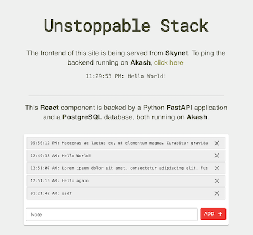
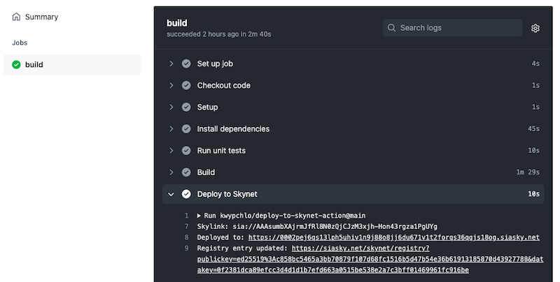
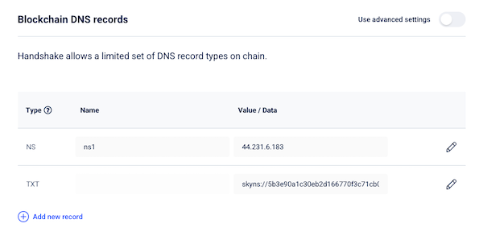

# Unstoppable Stack

This repository serves as a general guide and proof of concept for **deploying a full-stack web application onto blockchain-based decentralized infrastructure**.

The repository is structured as a **monorepo** - with **infrastructure configuration**, **application frontend code**, and **application backend code** all in one repository. This is done so that anyone can clone or fork this one repository and begin to experiment with deploying a decentralized web application.


## Decentralized infrastructure

| DNS | Frontend  | Backend |
|:---:|:---:|:---:|
|  |  |  |
| [Handshake](https://handshake.org/) | [Skynet](https://siasky.net/) | [Akash](https://akash.network/) |

## Web application
The demo application deployed in this guide is a note app - with create, read, delete functionality. It serves as a minimal proof of concept for deploying a multier web application to decentralized infrastructure.

| Frontend  | Backend | Database |
|:---:|:---:|:---:|
| [React](https://reactjs.org/) | [Python FastAPI](https://fastapi.tiangolo.com/)| [PostgreSQL](https://www.postgresql.org/) |

The application structure is bootstrapped using this **cookiecutter** template [https://github.com/Buuntu/fastapi-react](https://github.com/Buuntu/fastapi-react). The **docker** image is based on [tiangolo/uvicorn-gunicorn-fastapi-docker](https://github.com/tiangolo/uvicorn-gunicorn-fastapi-docker).

The application code, technology choices, and configuration used in this repository should provide a general enough base to fork and adapt, or just reference, for future decentralized web application development.

## Deployed Demo

A deployed **live demo** of the code in this repository is accessible at **[https://unstoppable-stack.hns.siasky.net/](https://unstoppable-stack.hns.siasky.net/)**. This demo was deployed using the steps in this guide.



## Step 1 - Buy Handshake domain
There are a few simple options for registering a **Handshake** domain name:

1. Use a platform like **Namebase** [https://www.namebase.io/](https://www.namebase.io/) or a tool like **Bob Wallet** [https://github.com/kyokan/bob-wallet ](https://github.com/kyokan/bob-wallet) to purchase a top-level Handshake domain.

	Domain purchases using Handshake are achieved through an [auction process](https://www.namebase.io/blog/tutorial-3-basics-of-handshake-auction-and-bidding). It will take **10 days** for your auction to finalize. and a winning bid, before you can make use of the domain.

2. Use **gateway.io** [https://gateway.io/](https://gateway.io/) to purchase a domain under one of gateway's existing top-level Handshake domains, like **.c** or **.api**. Domains purchased in this way are **usable immediately**.

## Step 2 - Push Docker image

1. Make sure **Docker** [https://www.docker.com/](https://www.docker.com/) is installed
2. **CD** to the directory where your `Dockerfile` is. For this repository, it is in `application/backend/Dockerfile`
2. **Build** and **tag** docker image `docker build -t <username>/<image-name>:<tag> .` 
3. **Login** to dockerhub `docker login --username=<username>`. You will be prompted for password.
4. **Push** your docker image to dockerhub `docker push <username/<image-name>`. Paste this yaml into the tool.

## Step 3 - Deploy back-end to Akash

You can deploy to Akash using the **standard Akash CLI** directly [https://docs.akash.network/guides/install](https://docs.akash.network/guides/install) but for the purpose of this guide, I am using **tombeynon's Akash Deploy UI** [https://github.com/tombeynon/akash-deploy](https://github.com/tombeynon/akash-deploy) which is a tool built on top of the standard CLI. Steps for deploying to Akash using this tool are below.

1. Start the **Akash Deploy UI** tool by running the following:
	```
	docker run -v ~/.akash-ui:/root/akash -p 3000:3000 --rm -it tombeynon/akash-deploy
	```
2. Visit [http://localhost:3000
]() to access the tool
3. Use the tool to **create a new wallet**. Make sure to record your mnemonic phrase so that you can restore the wallet if needed in the future.
4. **Fund this new wallet with at least 5 AKT** (5,000,000 UAKT) by transferring 5 AKT or more to the displayed wallet address.
5. **Create a new certificate**. This certificate only needs to be created once and will be used for all future deployments.
6. **Create a new deployment** using `akash/deploy-sample.yml` as a template.
7. Once you have created your deployment, you will start to receive bids. You can view these in the tool.
8. Chose a bid and **Create a lease**, then **Send manifest**.
9. At this point the tool will show you your **Web URIs** which you can use to access your application.


## Step 4 - Deploy front-end to Skynet
Deployment of the front-end to Skynet is **handled automatically** in this repository, using **GitHub Actions**. When any update to the `application/frontend/` directory is pushed to the *master* branch, the Action workflow will be run automatically by GitHub. This [workflow](https://github.com/bcfus/unstoppable-stack/blob/master/.github/workflows/frontend.yml) tests, builds, and deploys the static files to **Skynet**.

This GitHub workflow is based on the excellent write up by **Karol Wypchło** [https://blog.sia.tech/automated-deployments-on-skynet-28d2f32f6ca1](https://blog.sia.tech/automated-deployments-on-skynet-28d2f32f6ca1) and uses his pre-built Skynet deploy Action. 

The result of this GitHub Action is a **Skynet registry entry** that provides a constant point of reference for your DNS record. The **Skylink** itself changes with each deployment to Skynet and would require you to constantly update your DNS record if referencing it directly.

## Step 5 - Configure Handshake domain
**Once your GitHub action completes**, in the Action log in GitHub under the *Deply to Skynet* step, you will see a link to `https://siasky.net/skynet/registry` with parameters in the URL for `publickey` and `datakey`.

You now need to copy those param values and create your `skyns://` URL in the format `skyns://<publickey>/<datakey>`. The registry link will remain constant in the future, so this is a one-time manual step.



If using **Namebase**, you can now configure your Handshake domain to point to your Skynet hosted frontend by adding a TXT record under the *Blockchain DNS Records* section on your domain manage page. The value of this record is the `skyns://<publickey>/<datakey>` URL that you just generated above.



This **initial DNS configuration can take up to ~6 hours to be synced**. For all future code changes pushed to the *master* branch, the *Deploy to Skynet* Action will automatically update your Skynet Registry data and you should see the changes reflected very quickly.

**Once the DNS change takes effect**, your site will be accessible at `https://<hns-domain>.hns.siasky.net`. For example, the demo application for this guide is accessible at [https://unstoppable-stack.hns.siasky.net/](https://unstoppable-stack.hns.siasky.net/)

## Step 6 - Setup HTTPS URL for API
Although you can now make requests directly to your Akash URL over HTTP successfully, if you attempt to make these requests from your frontend that is being served over HTTPS, your API call will be blocked due to **Mixed Content**.

It is likey possible to enabled an HTTPS connection just using Akash deployment configuration but I was unable to find any documentation on this functionality. 

The approach used in this guide is to sign up a free [Cloudflare](https://cloudflare.com) account and set up their **flexible** SSL/TLS encryption mode on a secondary (non-Handshake) domain in order to provide an HTTPS entrpoint that proxies requests to our Akash API server.

Support for HTTPS with Akash is something that I expect to revisit soon.


## Step 7 - Setup database backups
Database backups can be stored in a decentralized manner on **Sia**, **Skynet**, or **Storj** by using **Filebase** [https://filebase.com/ ](https://filebase.com/)which is an S3-compatible object storage platform. There are a number of services that integrate with **Filebase** to provide automated backups.

- **BackupNinja** [https://docs.filebase.com/partner-integrations/backupninja](https://docs.filebase.com/partner-integrations/backupninja)
-  **SimpleBackups** [https://simplebackups.io/filebase-backup-and-restore/](https://simplebackups.io/filebase-backup-and-restore/)
-  **SharpShooter** [https://docs.filebase.com/partner-integrations/snapshooter](https://docs.filebase.com/partner-integrations/snapshooter)

## Run demo application locally
To run the application locally, you can follow the steps below.

1. Stand up FastAPI and PostgreSQL **backend**

	```
	cd backend
	docker-compose up --build
	```
2. In a separate terminal, stand up the React **frontend**
	
	```
	cd frontend
	npm install
	npm run start
	```

You can now **visit [http://localhost:3000](http://localhost:3000)** in the browser to **access the UI**. For testing the **API**, requests can be made to port 80, **Example**: `GET http://localhost:80/api/v1/notes`
